

  

<h1 align="center">🎫 EventHub – Plateforme de Gestion d’Événements</h1>

  <b>Projet universitaire • Java • POO • Interface graphique</b>

  
  
  
  

---

## 🟥 Présentation du projet
EventHub est une application développée dans le cadre d’un projet universitaire.  
Elle permet de gérer des événements, des utilisateurs et des inscriptions
à travers une interface moderne et intuitive.

Le projet vise à faciliter l’organisation, la planification et le suivi des événements.

---

## 🟥 Objectifs du projet
-  Concevoir une plateforme de gestion d’événements  
-  Mettre en pratique la programmation orientée objet (POO)  
-  Développer une application structurée  
-  Améliorer l’expérience utilisateur  
-  Centraliser les informations liées aux événements  

---

## 🟥 Fonctionnalités principales
-  Création et gestion d’événements  
-  Gestion des utilisateurs  
-  Inscriptions aux événements  
-  Gestion des salles  
-  Tableau de bord administratif  
-  Interface graphique interactive  

---

## 🟥 Aperçu de l’interface

  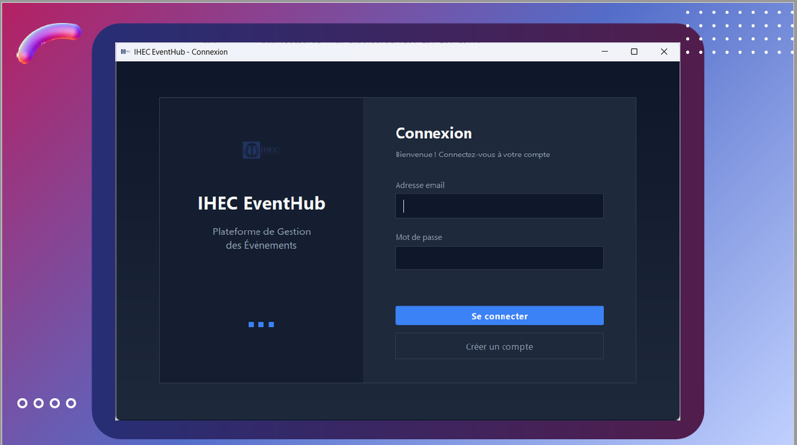
  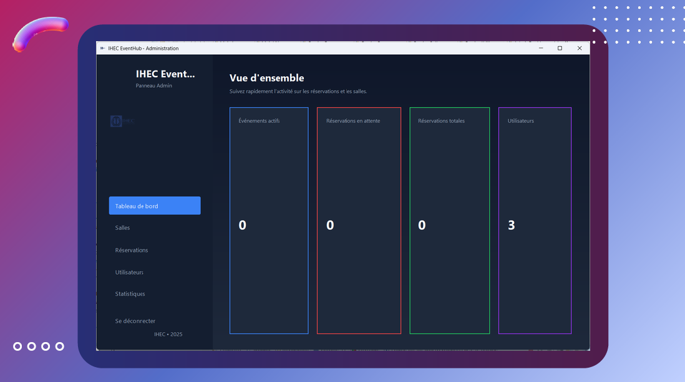
  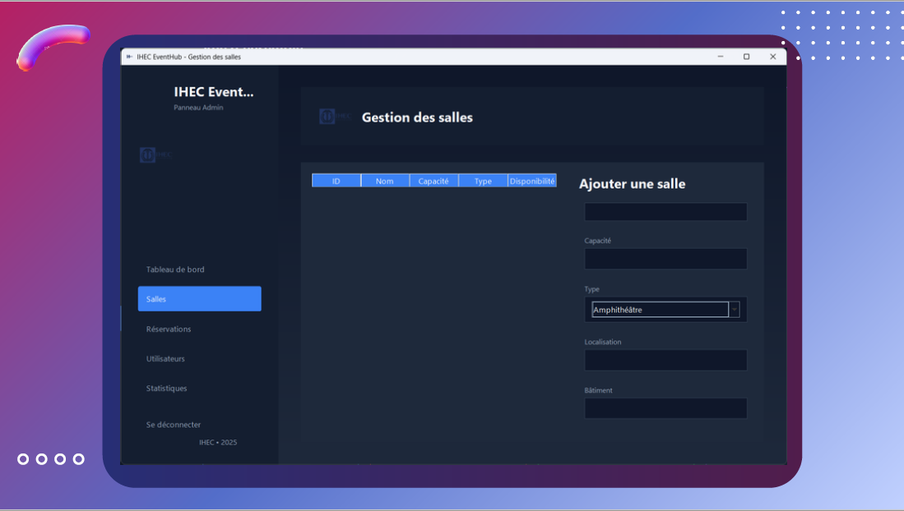

  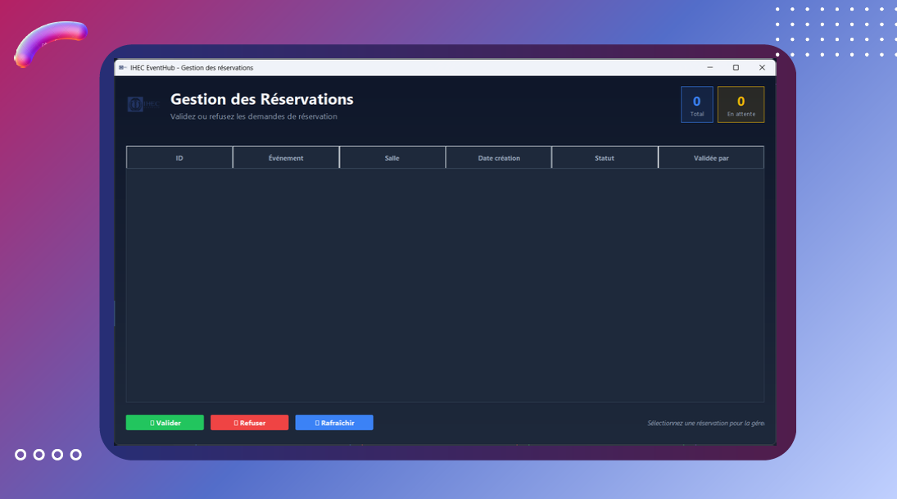
  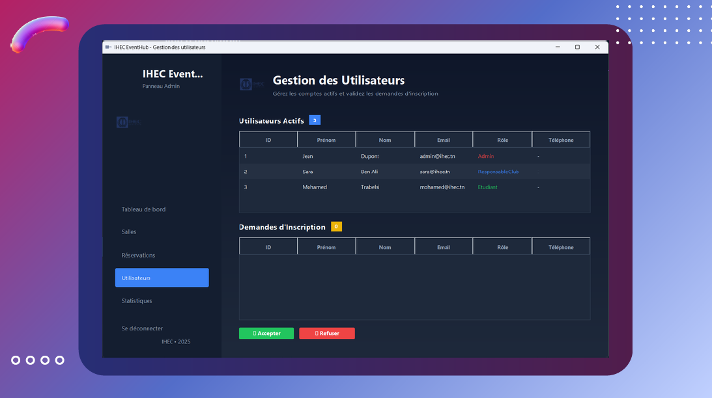
  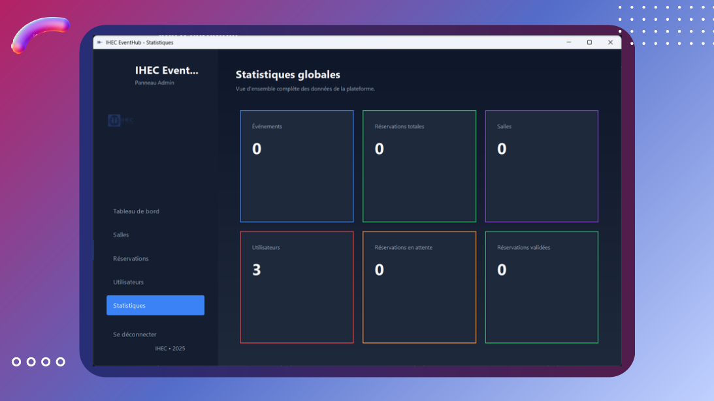

  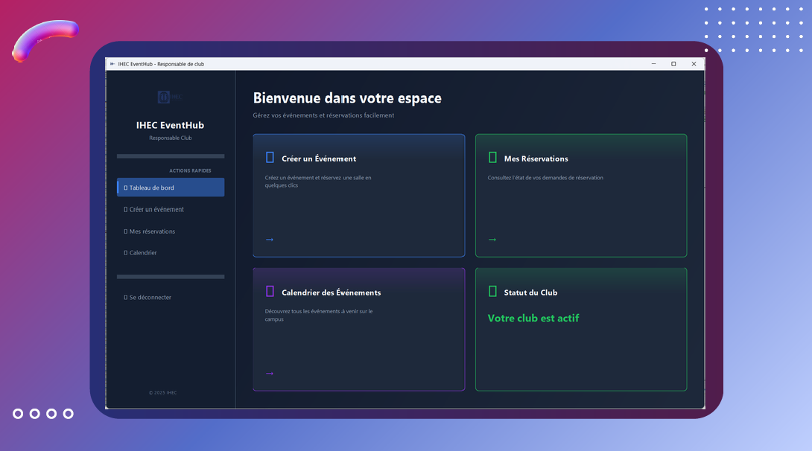
  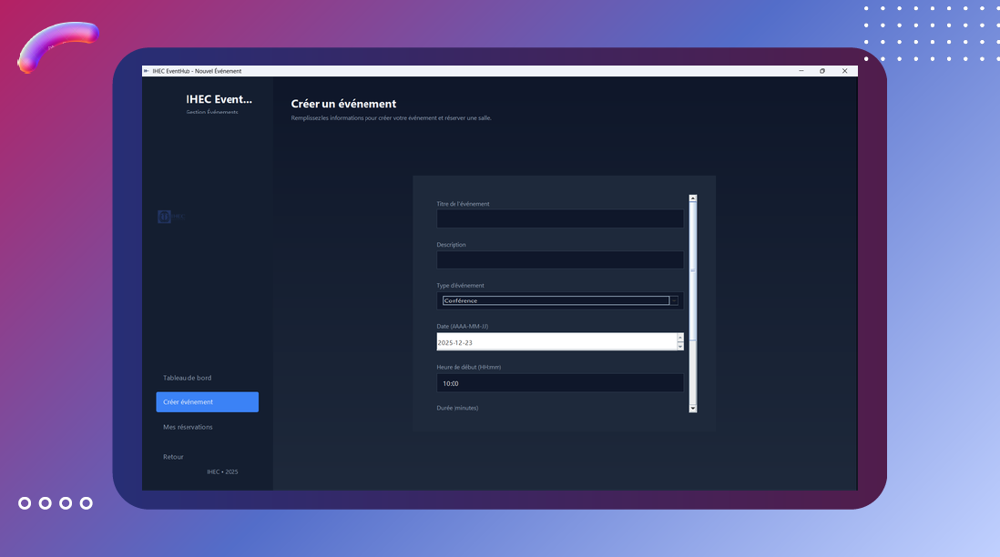
  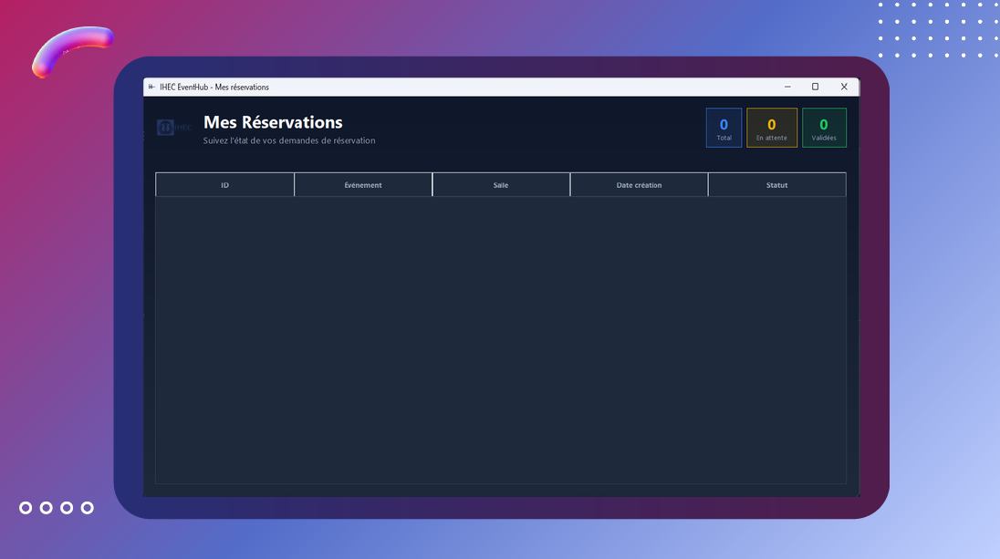

  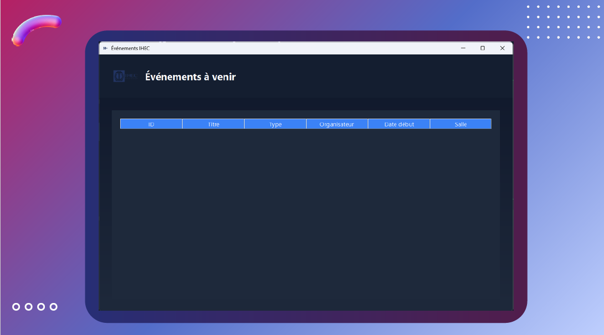
  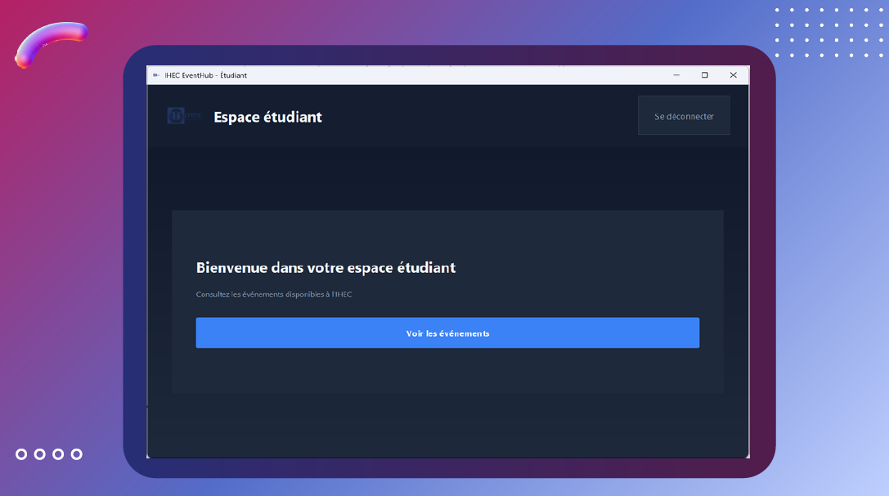
  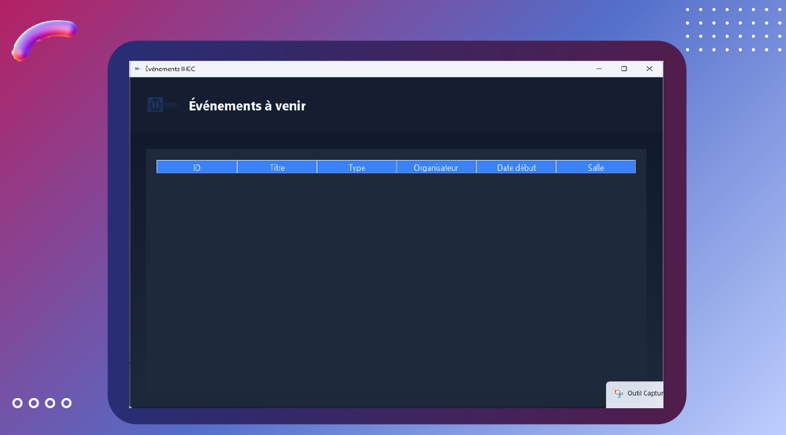

  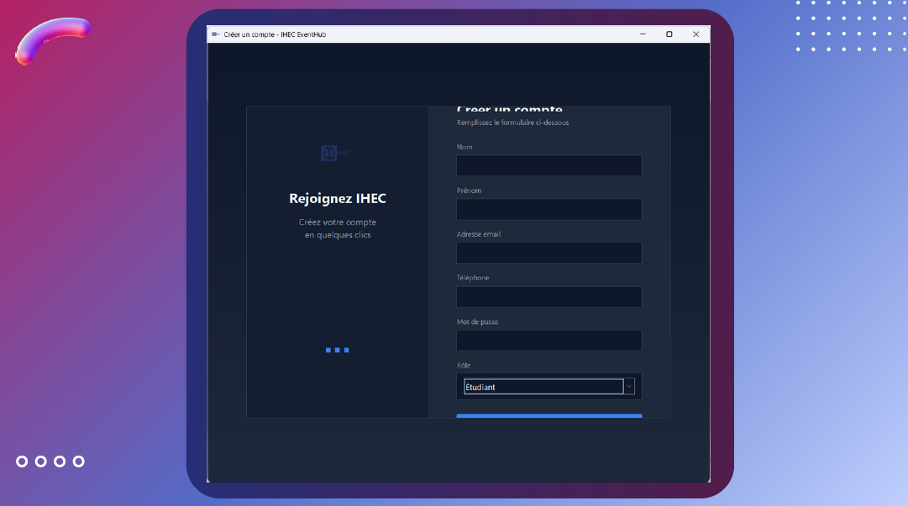

---

## 🟥 Technologies utilisées
-  Java  
-  Programmation Orientée Objet (POO)  
-  Eclipse / IntelliJ IDEA  
-  UML  
-  Base de données (si utilisée)  

---

## 🟥 Documentation
-  Rapport du projet (DOCX)  
-  Présentation du projet (PDF)  
-  Charte graphique (logo & palette)  

---

## 🟥 Exécution du projet
L’application est exécutable via les fichiers compilés `.class`
présents dans les dossiers `main`, `models` et `services`.

---

  <i>📁 Dépôt destiné à la présentation du projet dans un cadre académique (portfolio).</i>

